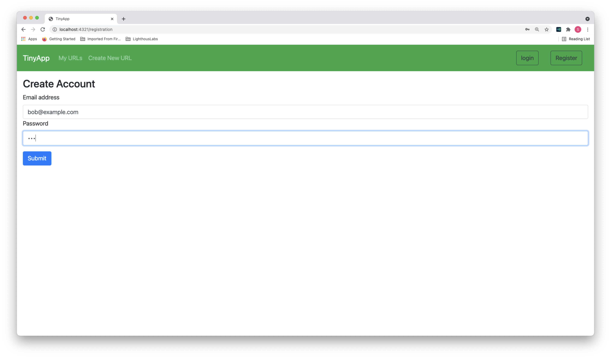
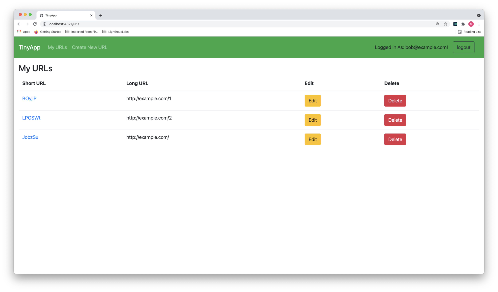

# TinyApp Project

TinyApp is a full stack web application built with Node and Express that allows users to shorten long URLs (à la bit.ly).

## Final Product

## Dependencies

- Node.js
- Express
- EJS
- bcrypt
- body-parser
- cookie-session
- morgan
- mocha
- chai
- nodemon

## Getting Started

- Install all dependencies (using the `npm install` command).
- Run the development web server using the `run npm` command.
- Set all required PORT settings to '4321', or change the PORT # in server_express.js

## Future Implementation

- Will keep track of date created or edited
- Will track number of times a link is used
- Will track number of unique users use the link
